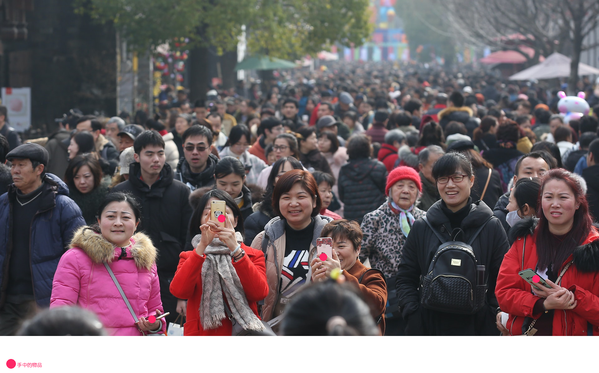

###  allenai_molmo_wrapper
正如你所见


### tools

* Google Plugin `Get cookies.txt LOCALLY 0.6.3` open `https://molmo.allenai.org/` call plugin `Export AS` to `cookie_file.json`


### allenai_molmo_wrapper

* Question Image(`找到 手中的物品 并标记他们的位置`)


* Result Image




### request record

* in `recorded_requests.json`

### log


```bash

2024-10-09 12:13:37,889 - INFO - Get LATEST chromedriver version for google-chrome
2024-10-09 12:13:38,106 - INFO - Get LATEST chromedriver version for google-chrome
2024-10-09 12:13:38,656 - INFO - Driver [/Users/firshme/.wdm/drivers/chromedriver/mac64/129.0.6668.91/chromedriver-mac-arm64/chromedriver] found in cache
2024-10-09 12:13:40,663 - INFO - Successfully added cookie: __Host-authjs.csrf-token
2024-10-09 12:13:40,666 - INFO - Successfully added cookie: SL_G_WPT_TO
2024-10-09 12:13:40,668 - INFO - Successfully added cookie: SL_XXXXX_Show_Hide_tmp
2024-10-09 12:13:40,671 - INFO - Successfully added cookie: SL_XXXXXXXXXXXX
2024-10-09 12:13:40,673 - INFO - Successfully added cookie: __Secure-authjs.callback-url
2024-10-09 12:13:40,676 - INFO - Successfully added cookie: playbackRate
2024-10-09 12:13:40,678 - INFO - Successfully added cookie: __Secure-authjs.session-token
Injecting JavaScript code
Injection result: None
Check result: window.__recordedRequests is set
2024-10-09 12:13:40,788 - INFO - New chat created at: https://molmo.allenai.org/new
2024-10-09 12:13:41,605 - INFO - Image uploaded: /Users/firshme/Desktop/GPT/allenai_molmo_wrapper/test.jpeg
2024-10-09 12:13:42,407 - INFO - Checkbox clicked
2024-10-09 12:13:43,712 - INFO - Button 'Next' clicked
2024-10-09 12:13:43,995 - INFO - Checkbox clicked
2024-10-09 12:13:45,294 - INFO - Button 'Let' clicked
2024-10-09 12:13:45,320 - INFO - Response listener injected successfully
2024-10-09 12:13:45,668 - INFO - Question inputted: 找到 手中的物品 并标记他们的位置
2024-10-09 12:13:45,958 - INFO - Question sent
2024-10-09 12:13:50,540 - INFO - Extracted Data: {'model': 'Molmo 7B-D', 'title': '找到 手中的物品 并标记他们的位置', 'contents': ['<points x1="25.4" y1="95.0" x2="37.0" y2="65.0" x3="54.0" y3="76.5" x4="89.5" y4="83.0" alt="手中的物品">手中的物品</points>']}
Waiting for 3 seconds to capture requests
Retrieving captured requests
Successfully captured 32 requests
Recorded 32 requests to recorded_requests.json
2024-10-09 12:13:50,719 - INFO - Browser closed
2024-10-09 12:13:50,720 - INFO - Result: {'model': 'Molmo 7B-D', 'title': '找到 手中的物品 并标记他们的位置', 'contents': ['<points x1="25.4" y1="95.0" x2="37.0" y2="65.0" x3="54.0" y3="76.5" x4="89.5" y4="83.0" alt="手中的物品">手中的物品</points>']}
2024-10-09 12:13:50,720 - INFO - parse_points: [{'coordinates': [(25.4, 95.0), (37.0, 65.0), (54.0, 76.5), (89.5, 83.0)], 'alt': '手中的物品', 'text': '手中的物品'}]
2024-10-09 12:13:51,360 - INFO - Generation time: 12.942886114120483 seconds

```

## 鸣谢

本项目使用了由Allen Institute for AI (AI2)开发的[Molmo](https://molmo.allenai.org/)。Molmo是一个强大的多模态开放语言模型,为我们的项目提供了关键的AI能力。

我们衷心感谢AI2团队开发并开放使用这一出色的工具。

### 关于Molmo

Molmo是一个由AI2开发的多模态开放语言模型。它能够处理文本和图像输入,展现了强大的理解和生成能力。更多信息请访问[Molmo官方网站](https://molmo.allenai.org/)。